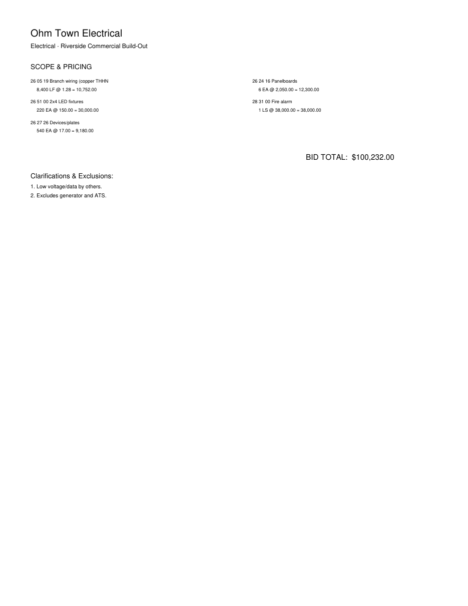
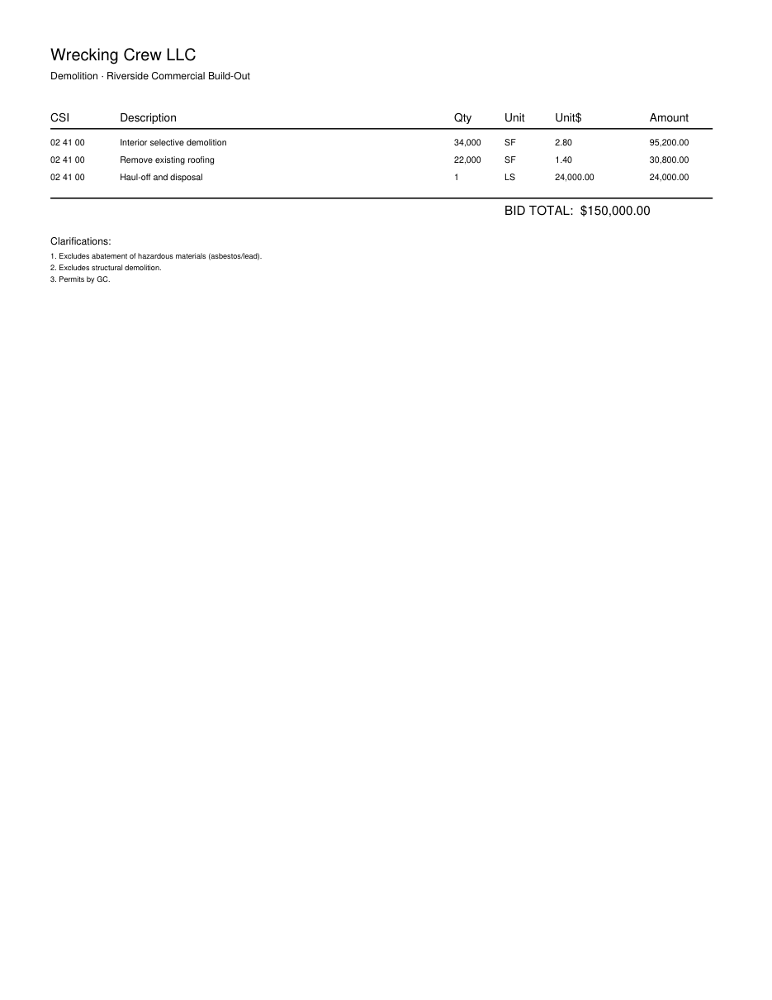

# BidReader — Evidence Pack

BidReader run across **14 synthetic but messy** construction bids (prose-buried exclusions, fine-print footnotes, two-column layouts, planted arithmetic errors, multi-page, and image-only **scanned** docs). Authored here → exact ground truth, freely redistributable. Reproduce: `python demo/make_corpus.py && python demo/run_eval.py`.

## Aggregate (honest — includes failures)

| metric | result |
|---|---|
| Documents | 14 (2 scanned) |
| Line-item recall | **100%** |
| Exclusion-catch recall | **97%** |
| Bid-total accuracy (±3%) | **100%** |
| Arithmetic errors caught | **3/3** |
| No-hallucination (clean doc) | PASS |
| Scanned docs OCR'd & extracted | 2/2 |

## Per document

| doc | trade | input | line items | exclusions | math | total | notes |
|---|---|---|---|---|---|---|---|
| `elec_sub_a` | Electrical | text | 4/4 (100%) | 3/3 | — | ✓ | ✓ |
| `elec_sub_b` | Electrical | text | 5/5 (100%) | 2/2 | — | ✓ | ✓ |
| `elec_sub_c` | Electrical | text | 5/5 (100%) | 4/4 | — | ✓ | ✓ |
| `elec_sub_d` | Electrical | text | 5/5 (100%) | 2/2 | 1/1 | ✓ | ✓ |
| `dw_sub_a` | Drywall | text | 4/4 (100%) | 3/3 | — | ✓ | ✓ |
| `dw_sub_b` | Drywall | text | 5/5 (100%) | 2/2 | — | ✓ | ✓ |
| `dw_sub_c` | Drywall | text | 3/3 (100%) | 4/4 | 1/1 | ✓ | ✓ |
| `plumbing_quote` | Plumbing | text | 4/4 (100%) | 3/3 | — | ✓ | ✓ |
| `roofing_spec` | Roofing | text | 3/3 (100%) | 3/3 | — | ✓ | ✓ |
| `concrete_multipage` | Concrete | text | 6/6 (100%) | 3/3 | — | ✓ | ✓ |
| `steel_errors` | Structural Steel | text | 4/4 (100%) | 3/3 | 1/1 | ✓ | ✓ |
| `painting_clean` | Painting | text | 3/3 (100%) | n/a | — | ✓ | ✓ |
| `hvac_scanned` | HVAC | scan→OCR | 4/4 (100%) | 3/3 | — | ✓ | ✓ |
| `demo_scanned_messy` | Demolition | scan→OCR | 3/3 (100%) | 2/3 | — | ✓ | ⚠ missed excl |

## Honest failure / weakness notes

- `demo_scanned_messy` (footnote): 1 exclusion(s) missed

## Bid leveling — Excel output (the bid-day workflow)

Multiple subs → one workbook, bidders as columns, exclusion matrix exposing the *apparent low bid that carved out scope*. Workbooks: `leveling_electrical.xlsx`, `leveling_drywall.xlsx`.

### Electrical (4 subs)
```
BID LEVELING — Voltage Bros Elect vs Current Co vs Sparky Solutions L vs Ohm Town Electrica

                              Voltage Bros Ele        Current Co  Sparky Solutions  Ohm Town Electri
Trade                               Electrical        Electrical        Electrical        Electrical
Bid total                              $64,300          $108,890           $77,520          $100,232
Line items                                   4                 5                 5                 5
Math flags                                   0                 0                 0                 1
# exclusions                                 3                 2                 4                 2

SCOPE / EXCLUSION MATRIX  (X = this bidder excluded it):
exclusion                     Voltage Bros Ele        Current Co  Sparky Solutions  Ohm Town Electri
Fire alarm system and devic               X p1                 —              X p1                 —
Low voltage / data cabling                X p1              X p1              X p1              X p1
Temporary power and tempora               X p1                 —              X p1                 —
Equipment pads                               —              X p1                 —                 —
Permits                                      —                 —              X p1                 —
Generator & ATS                              —                 —                 —              X p1
```
### Drywall (3 subs)
```
BID LEVELING — Acme Drywall & Fra vs Premier Wall Syste vs BudgetBoard Co

                              Acme Drywall & F  Premier Wall Sys    BudgetBoard Co
Trade                                  Drywall           Drywall           Drywall
Bid total                             $108,748          $123,988           $90,680
Line items                                   4                 5                 3
Math flags                                   0                 0                 1
# exclusions                                 3                 2                 4

SCOPE / EXCLUSION MATRIX  (X = this bidder excluded it):
exclusion                     Acme Drywall & F  Premier Wall Sys    BudgetBoard Co
Fire-stopping                             X p1                 —              X p1
High scaffolding                          X p1                 —              X p1
Final cleaning                            X p1              X p1              X p1
Scaffolding/Lifts                            —              X p1                 —
Insulation                                   —                 —              X p1
```

## Sample messy inputs




_Synthetic corpus; results vary by model. Outputs are proposals to verify, never final numbers._
